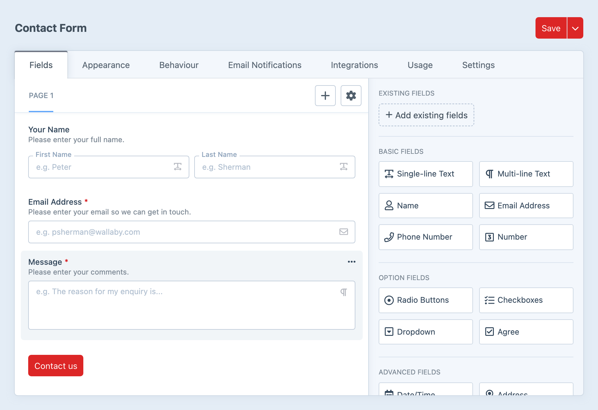
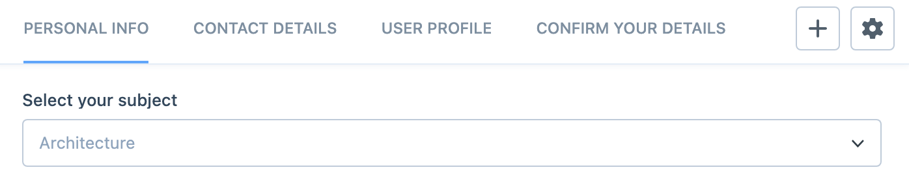

# Form Builder

The form builder is where most form work starts, and for most projects it is where the real shape of the form gets decided.

You use it to add pages and fields, but also to decide how the form should behave once it is live.

## Building the form

At its simplest, the builder lets you:

- add fields to a page
- arrange them into rows and columns
- split a form into multiple pages
- reuse existing fields
- add synced fields when the same field should stay shared across forms

For many forms, that is enough to get the structure in place. The more important decisions usually come from the settings that sit around the builder, because they affect how the form feels to the person filling it out.

## Form settings

Each form controls how submission feels on the front end.

The main choices are:

- whether the form submits with a page reload or Ajax
- what should happen after a successful submission
- where success and error messages should appear
- whether validation should happen only on submit, or also while someone is moving through the form

These settings matter most when they change the experience in a meaningful way. You will not need to tune every option on every form, but the ones that affect submission flow are worth knowing.

Forms can also decide who can submit and when.

Common examples are:

- requiring a logged-in user
- opening or closing a form on a schedule
- limiting how many submissions are allowed
- showing a clear message when the form is unavailable

This is the part of Formie that turns a form from a collection of fields into something a little more deliberate and controlled.

Form settings also control what a saved submission looks like and how long it is kept.

Important examples include:

- the default submission status
- the submission title format
- whether to collect the visitor IP address
- whether to link the submission to a logged-in Craft user
- how long to retain submission data
- whether file uploads should be kept when a submission is permanently deleted

These settings often end up being driven by policy rather than design, so it helps to check them early instead of leaving them until launch week.

## Multi-page forms

Multi-page forms are not just a layout choice.

They affect:

- page-to-page progress
- incomplete submissions
- save and continue later flows
- conditions that skip pages entirely

If the form uses multiple pages, also read [Save & Continue Later](/forms/save-continue-later) and [Conditions](/forms/conditions).

## Usage

The builder also includes a usage view so you can see where a form is being selected elsewhere in Craft.

That is especially helpful before changing or deleting a form, because it gives you a quick way to find entries or other elements that depend on it.
