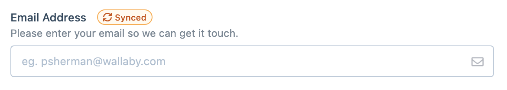

# Synced Fields

Synced fields let you reuse the same field definition across multiple forms.

They are useful when a field should stay consistent everywhere it appears, instead of becoming a separate copy in each form. When a field is added as a synced field, Formie links it to the original field, so changes made to one instance are reflected everywhere that synced field is used.

This is especially useful for fields that appear repeatedly across a site, such as email addresses, phone numbers, consent checkboxes, and other common contact details.

## When to use synced fields

Synced fields are a good fit when:

- the field should behave the same way in every form
- you want one change to update every use of that field
- you are trying to avoid duplicated maintenance

They are a poor fit when a field only looks similar but needs to drift over time. In that case, a normal copied field is usually the better choice.

## Adding a synced field

In the form builder, add a field from the existing fields picker instead of creating a new one. When you choose an existing field, you can add it as a synced field so it stays linked to the original.

That same picker can also add a normal copied field instead. The difference is important:

- a copied field starts as a duplicate, then becomes independent
- a synced field stays linked

Because the field stays linked, editing it in one form means editing it everywhere. That is what makes synced fields useful, but it is also why they need a little more care.

## Working with shared fields

Formie warns you about this in the builder, but it is still worth being deliberate. If you need an independent version later, the usual answer is to create a new field rather than trying to keep changing a shared one.
