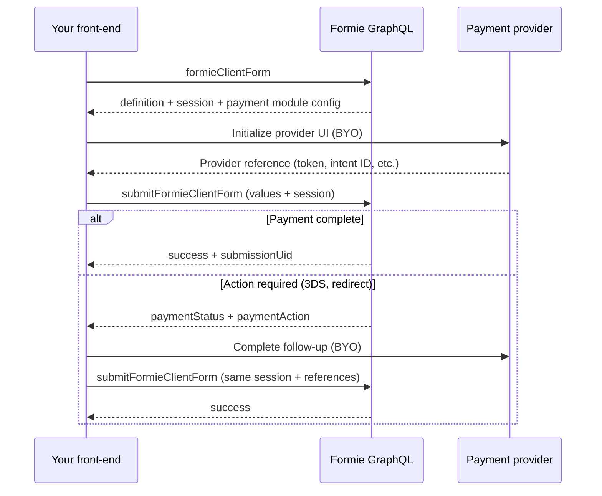

# Headless Payments

Headless and GraphQL front-ends handle payment UI with the provider’s own SDK (Stripe.js, PayPal Buttons, and so on). Formie handles submission workflow, server-side charging, webhooks, and continuation on the **same submission session**.

This is a **bring-your-own (BYO) payment UI** model:

- **You** render provider UI, collect tokens or intent IDs, and run 3DS or redirect flows in your app.
- **Formie** exposes form/session config via GraphQL, accepts provider references on submit, and returns structured payment follow-up metadata.

For turnkey browser-managed forms (Twig, `formieHtmlForm`, or `@verbb/formie-browser`), use the standard [Stripe integration docs](/integrations/payments/stripe) instead. That path is separate from headless BYO.

## Recommended GraphQL Flow

Use the client form API rather than raw `save_<handle>_Submission` mutations. Payments depend on session continuity, replay protection, and follow-up submits on the same submission.



### 1. Load the form

```graphql
query FormieClientForm($handle: String!, $siteId: Int) {
    formieClientForm(handle: $handle, siteId: $siteId) {
        schemaVersion
        definition
        session
    }
}
```

Read payment configuration from the Payment field module in `definition`. Each enabled provider exposes:

- `publishableKey`, `clientId`, or equivalent public config
- `initialPaymentInformation` (amount/currency hints for dynamic pricing)
- `requiredInputSuffixes` — keys your front-end must send back to Formie on submit

You can also query field metadata via `formieForm` when you need `inputTypeName` for typed mutation arguments.

### 2. Submit with provider references

```graphql
mutation SubmitFormieClientForm($input: FormieClientSubmitInput!) {
    submitFormieClientForm(input: $input) {
        success
        submissionUid
        session {
            id
            continuation
            tokens
        }
        paymentStatus
        paymentMessage
        paymentRedirectUrl
        paymentAction
        paymentDecision
        keepSubmitLoading
        errors
        messages
    }
}
```

Pass payment values in `input.values` using the Payment field’s builder ID as the key. For Stripe:

```json
{
    "input": {
        "handle": "checkoutForm",
        "action": "submit",
        "session": { "...": "..." },
        "values": {
            "field-payment-123": {
                "stripePaymentIntentId": "pi_3Example",
                "stripePaymentId": "pm_1Example"
            }
        }
    }
}
```

Form-specific submission mutations (`save_<handle>_Submission`) also accept structured payment input when the Payment field has provider-specific keys configured. Prefer `submitFormieClientForm` for headless apps.

### 3. Handle payment follow-up

When Formie needs more work from the provider, the submit result includes:

Field | Description
--- | ---
`paymentStatus` | `actionRequired`, `pending`, `failed`, `succeeded`, or `notRequired`
`paymentMessage` | User-facing message (show as a notice, not a validation error)
`paymentAction` | Structured action for your app (`type`, `payload`, `resume`, etc.)
`paymentDecision` | Full decision object from the submission workflow
`paymentRedirectUrl` | Off-site redirect URL when applicable
`keepSubmitLoading` | `true` when your UI should stay in a submitting state

**Important:** Resubmit with the **same `session` payload** (and the same provider references where needed). Formie resumes the existing submission instead of creating a duplicate.

`success` may be `false` when `paymentStatus` is `actionRequired` or `pending`. That is expected — check `paymentStatus`, not only `success`.

## Payment Input Types

Payment fields generate a form-specific GraphQL input type when the provider declares input keys:

```text
<formHandle>_<fieldHandle>_FormiePaymentInput
```

Redirect-only providers (Mollie, GoCardless, Paddle) use the generic `Json` type because no upfront references are required.

Discover the type name via:

```graphql
{
    formieForm(handle: "checkoutForm") {
        formFields {
            handle
            inputTypeName
        }
    }
}
```

## Provider Reference Guide

Use your provider’s SDK to collect the values below, then pass them to Formie on submit. Formie validates and processes payment server-side.

### Stripe

**BYO:** [Stripe.js](https://stripe.com/docs/js) + Payment Element or Card Element.

**Send to Formie:**

Key | Required | Description
--- | --- | ---
`stripePaymentIntentId` | Yes | PaymentIntent ID after creating or confirming client-side
`stripePaymentId` | No | PaymentMethod ID when useful for replay
`stripeSubscriptionId` | Subscriptions | Subscription ID for subscription payments

**Config from `formieClientForm`:** `publishableKey`, `paymentType`, `amountType`, `currencyType`, `initialPaymentInformation`, `billingDetails`.

**Follow-up:** When 3DS is required, Formie returns `paymentStatus: actionRequired` with `paymentAction.type: confirm` and a `payload.clientSecret`. Call `stripe.confirmPayment()` in your app, then resubmit the form with the same session and `stripePaymentIntentId`.

See [Stripe (headless)](/graphql/payments/stripe) for a full walkthrough.

### PayPal

**BYO:** [PayPal JavaScript SDK](https://developer.paypal.com/sdk/js/).

**Send to Formie:**

Key | Required | Description
--- | --- | ---
`paypalOrderId` | Yes | Order ID from the PayPal checkout flow
`paypalAuthId` | No | Authorization ID when already authorized client-side

### Square

**BYO:** [Square Web Payments SDK](https://developer.squareup.com/docs/web-payments/overview).

**Send to Formie:** `squarePaymentId`

### PayWay

**BYO:** PayWay REST API / hosted fields.

**Send to Formie:** `paywayTokenId`

### Opayo (formerly Sage Pay)

**BYO:** Opayo.js / hosted fields.

**Send to Formie:**

Key | Description
--- | ---
`opayoTokenId` | Card identifier token
`opayoSessionKey` | Session key from Opayo
`opayo3DSComplete` | Set when 3DS challenge completes

### Moneris

**BYO:** Moneris hosted tokenization.

**Send to Formie:** `monerisTokenId`

### eWAY

**BYO:** eWAY Rapid client-side tokenization.

**Send to Formie:** `ewayTokenData`

### Bpoint

**BYO:** Bpoint hosted payment page / tokenization.

**Send to Formie:** `bpointToken`

### Mollie

**BYO:** Redirect users to Mollie checkout (no upfront field values).

Formie returns `paymentRedirectUrl` or `paymentAction.type: redirect`. Send the user to the URL, then rely on webhook/callback completion or poll via resubmit with the same session.

### GoCardless

**BYO:** Redirect to the GoCardless hosted Billing Request Flow (Formie returns `redirectUrl` via payment action).

Formie creates a Billing Request with a Direct Debit mandate request, then redirects the customer to GoCardless. After authorisation, Formie creates the one-off payment against the mandate. Completion is asynchronous — use webhooks and resubmit the same session if needed.


### Paddle

**BYO:** Paddle.js overlay or checkout.

No upfront payment input keys. Follow Paddle’s checkout flow; Formie processes the result server-side.

## Multi-Page Forms

Collect payment field values on the final page only. Use `setFormieClientPage` to persist earlier pages, then submit when the user reaches the payment page.

