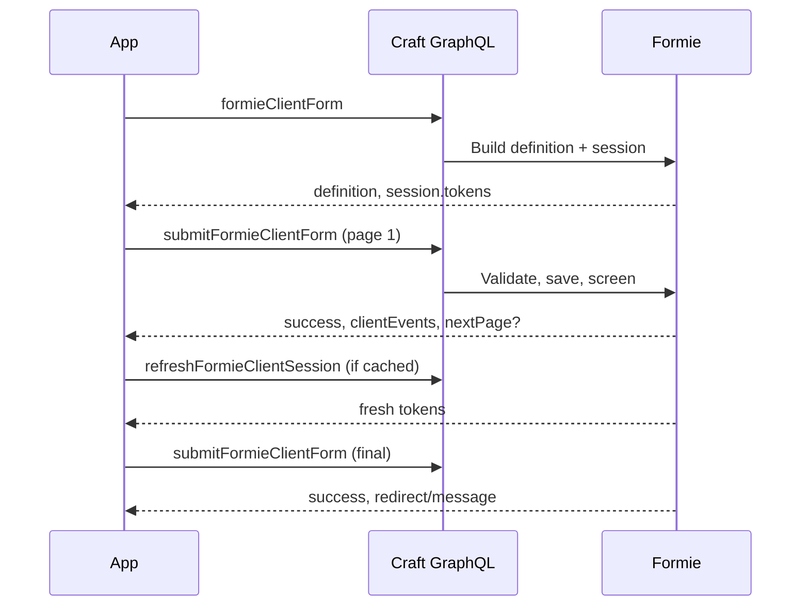

# GraphQL submission flow end-to-end

This walkthrough follows a contact form from GraphQL bootstrap through page navigation, token refresh, and final submission — the same flow `@verbb/formie-react` and `@verbb/formie-core` use internally. Use it when building a custom GraphQL client or debugging headless submit failures.

## Prerequisites

- Formie with GraphQL enabled and a public schema including Formie scopes
- A form with handle `contactForm` (adjust examples to match yours)
- [Query Forms](/graphql/query-forms), [Rendering Forms](/graphql/rendering-forms), [Create Submissions](/graphql/create-submissions)

## Overview



Formie front-end packages handle this sequence automatically. Custom clients should follow the same order.

## Step 1 — Bootstrap the form

Query `formieClientForm` for the structured definition and session:

```graphql
query FormieForm($handle: String!, $siteId: Int, $locale: String) {
    formieClientForm(handle: $handle, siteId: $siteId, locale: $locale) {
        schemaVersion
        definition
        session
    }
}
```

Variables:

```json
{
    "handle": "contactForm",
    "siteId": 1,
    "locale": "en"
}
```

Read tokens from `session.tokens`:

```json
{
    "session": {
        "id": "formie-contactForm-abc123",
        "currentPageId": "page-1",
        "tokens": {
            "csrf": {
                "name": "CRAFT_CSRF_TOKEN",
                "value": "3YV0bKqQx..."
            },
            "request": "m1f8A2pQ...",
            "render": "formie-contactForm-abc123",
            "captchas": {}
        }
    }
}
```

Store `request` and `csrf` — every submit and refresh needs them.

### Alternative — rendered HTML only

If you only need Formie-owned HTML (no custom field UI), use `formieHtmlForm`:

```graphql
query FormHtml($handle: String!, $input: ServerRenderPayloadInput) {
    formieHtmlForm(handle: $handle, input: $input) {
        html
    }
}
```

The HTML includes hidden inputs for CSRF and request tokens. Include browser assets separately. See [Rendering Forms](/graphql/rendering-forms).

## Step 2 — Inspect field input types

Before building a typed mutation, discover each field's GraphQL input type:

```graphql
{
    formieForm(handle: "contactForm") {
        formFields {
            handle
            inputTypeName
        }
    }
}
```

Complex fields use generated types like `contactForm_yourName_FormieNameInput`.

## Step 3 — Submit via the client mutation (recommended)

Formie front-end packages use `submitFormieClientForm` — a structured payload mutation that handles multi-page state, captchas, and payment follow-up.

Conceptually, your client sends:

- Current page field values
- Session ID and tokens from bootstrap
- Captcha responses when enabled

The exact input shape matches what `@verbb/formie-core` serializes. Prefer this mutation over raw per-form mutations when building on Formie's client stack.

## Step 4 — Submit via per-form mutation

Each form also has a dedicated mutation: `save_<formHandle>_Submission`.

Basic single-field example:

```graphql
mutation SaveSubmission($yourName: String) {
    save_contactForm_Submission(yourName: $yourName) {
        title
        ... on contactForm_Submission {
            yourName
        }
    }
}
```

With CSRF and request token (when `enableCsrfValidationForGuests` is on):

```graphql
mutation SaveSubmission(
    $yourName: String
    $requestToken: String
) {
    save_contactForm_Submission(
        yourName: $yourName
        requestToken: $requestToken
    ) {
        title
    }
}
```

### Name and Address fields

```graphql
mutation SaveSubmission(
    $yourName: contactForm_yourName_FormieNameInput
    $yourAddress: contactForm_yourAddress_FormieAddressInput
) {
    save_contactForm_Submission(yourName: $yourName, yourAddress: $yourAddress) {
        ... on contactForm_Submission {
            yourName
            yourAddress
        }
    }
}
```

```json
{
    "yourName": { "firstName": "Jane", "lastName": "Doe" },
    "yourAddress": {
        "address1": "42 Wallaby Way",
        "city": "Sydney",
        "state": "NSW",
        "zip": "2000",
        "country": "Australia"
    }
}
```

### Generic saveSubmission

When your client should not depend on form-specific mutation names:

```graphql
mutation SaveSubmission($formHandle: String!, $fields: ArrayType) {
    saveSubmission(formHandle: $formHandle, fields: $fields) {
        id
        ... on contactForm_Submission {
            yourName
            emailAddress
        }
    }
}
```

```json
{
    "formHandle": "contactForm",
    "fields": {
        "yourName": "Jane Doe",
        "emailAddress": "jane@example.test"
    }
}
```

For Formie npm packages, prefer `submitFormieClientForm`.

## Step 5 — Captchas

When a captcha is enabled, Formie adds an argument named `{handle}Captcha` in camelCase — for example `turnstileCaptcha`:

```graphql
mutation SaveSubmission(
    $yourName: String
    $turnstileCaptcha: FormieCaptchaInput
) {
    save_contactForm_Submission(
        yourName: $yourName
        turnstileCaptcha: $turnstileCaptcha
    ) {
        title
    }
}
```

```json
{
    "turnstileCaptcha": {
        "name": "cf-turnstile-response",
        "value": "<token from widget>"
    }
}
```

Query the generated schema for the exact argument name per form.

## Step 6 — Multi-page navigation

For multi-page forms:

1. Submit current page values.
2. If the response indicates a next page, update local state with the new page ID from the session.
3. Repeat until the final page completes.

Use `setFormieClientPage` when saving navigation state without a full submit (for example, back-button behaviour in custom UIs).

Incomplete submissions are saved in the database as the user progresses — the same as browser Ajax forms.

## Step 7 — Refresh session tokens

On statically cached pages or after failed submits, refresh tokens before retrying:

```graphql
mutation RefreshSession($handle: String!, $sessionId: String!) {
    refreshFormieClientSession(handle: $handle, sessionId: $sessionId) {
        session
    }
}
```

Apply the returned `session.tokens` to subsequent requests. See [Cached forms in production](/guides/frontend-headless/cached-forms-in-production).

## Step 8 — Handle validation errors

Validation failures return GraphQL errors with field messages in extensions:

```json
{
    "errors": [{
        "message": "{\"emailAddress\":[\"Email Address cannot be blank.\"]}",
        "extensions": {
            "category": "validation",
            "errors": {
                "emailAddress": ["Email Address cannot be blank."]
            }
        }
    }],
    "data": { "save_contactForm_Submission": null }
}
```

Map `extensions.errors` keys to field handles in your UI.

## Step 9 — Client events in the response

Successful Ajax/GraphQL submits include resolved analytics events:

```json
{
    "success": true,
    "clientEvents": [{
        "event": "formPageSubmission",
        "payload": {
            "event": "formPageSubmission",
            "formHandle": "contactForm",
            "email": "jane@example.com"
        }
    }]
}
```

Push to `dataLayer` or your analytics SDK in the client.

## Step 10 — Payments

Payment fields require provider UI (Stripe.js, and so on) and must use `submitFormieClientForm` so 3DS replay and session continuity work. See [Headless Payments](/graphql/payments).

## Submission guards note

Browser-only submission guards (honeypot, minimum submit time, form submit expiration) run for traditional form POSTs with `handle` and `submitAction`. GraphQL and client REST submissions skip browser-only guards but still require a valid `requestToken` from bootstrap.

## Related

- [Query Forms](/graphql/query-forms)
- [Create Submissions](/graphql/create-submissions)
- [Rendering Forms](/graphql/rendering-forms)
- [Building a headless contact form with Formie React](/guides/frontend-headless/building-a-headless-contact-form-with-formie-react)
- [Cached forms in production](/guides/frontend-headless/cached-forms-in-production)
