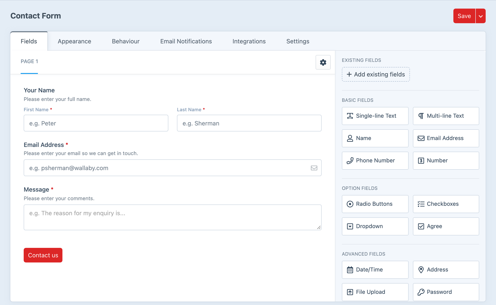
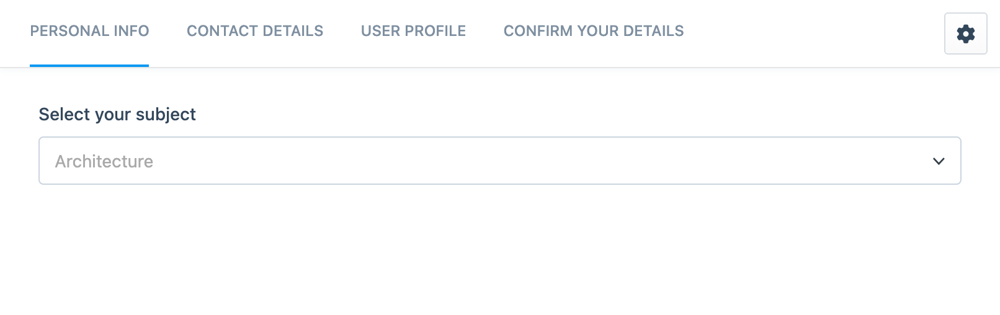
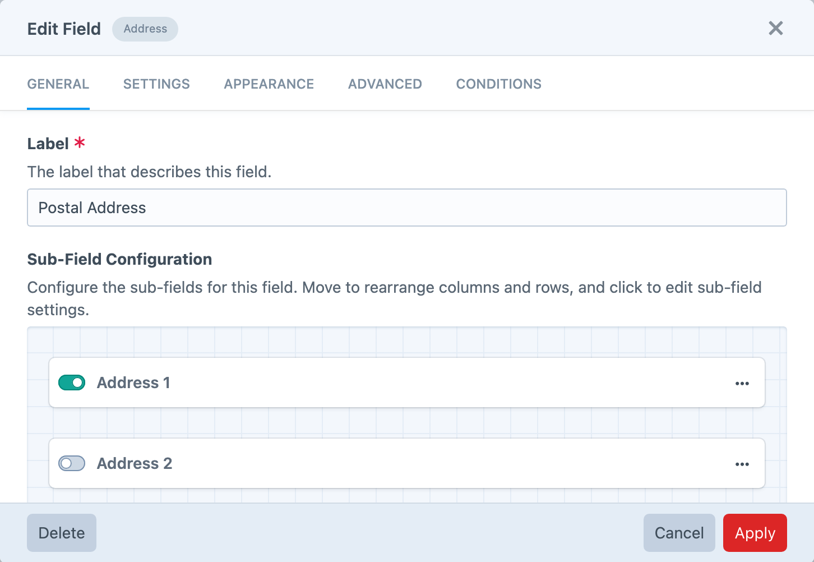
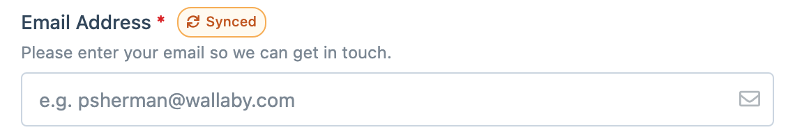
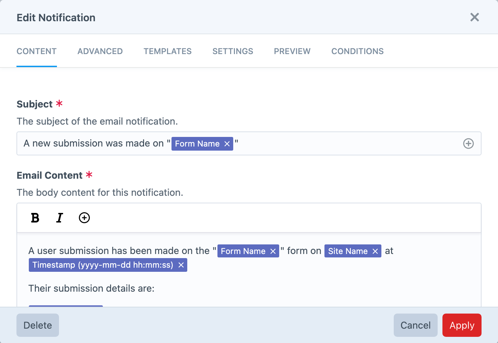
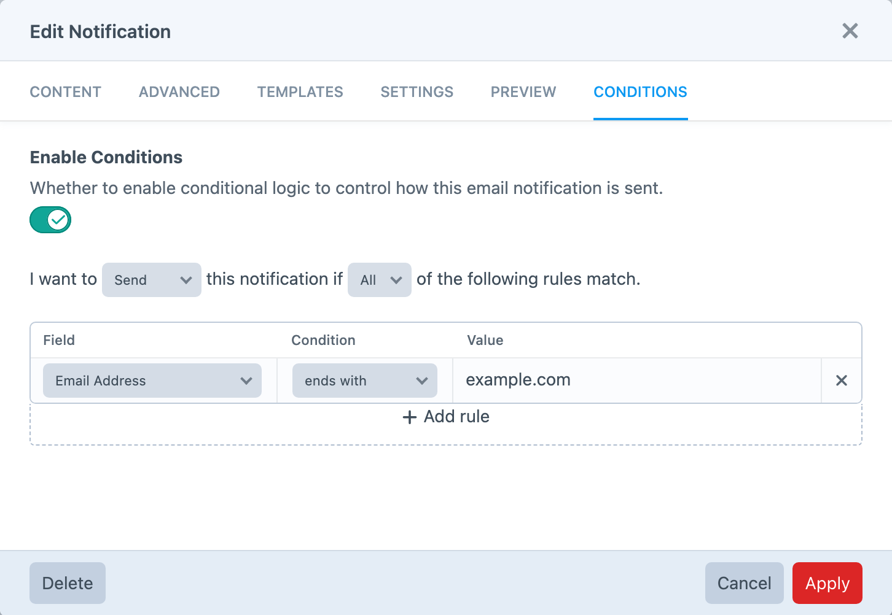
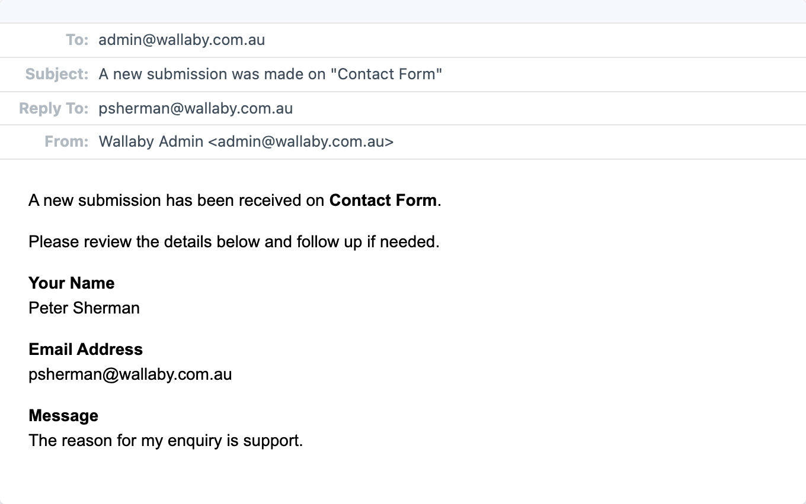
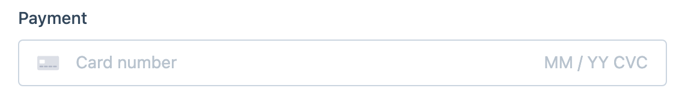
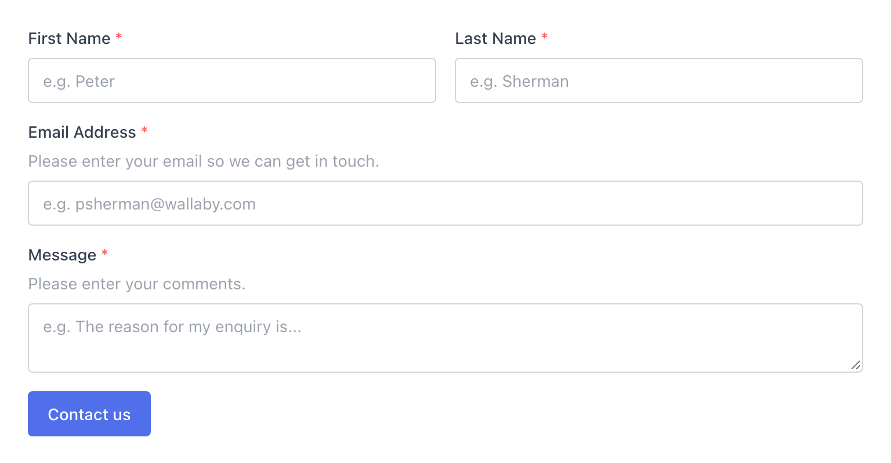

<!-- feature-intro -->
The most user-friendly forms plugin for Craft. Build sophisticated multi-page forms with more than 30 field types, email notifications, integrations and ready-to-go front-end templates — without giving up control when the project needs it.
<!-- feature-intro-end -->

<!-- feature-section media-size="large" -->
## Visual form builder

Create forms with an intuitive drag-and-drop builder. Fields sit in rows and columns for flexible layouts, so the form takes shape in the same place its settings are managed.

Stencils provide a ready-made starting point with fields, settings and notifications already in place, while form templates let teams reuse proven structures across the project.

<!-- feature-section-end -->

<!-- feature-section -->
## Multi-page forms

Turn the same builder into a quick contact form or a complete multi-step workflow. Give each page a clear purpose, control how visitors move between steps and apply conditions when a page only belongs in one path through the form.

<!-- feature-section-end -->

<!-- feature-section -->
## Fields for every form

Build straightforward contact forms and involved application flows from the same field library. Each field carries the defaults, validation, appearance and instructions its job requires, while more structured answers do not have to be forced into one flat response.

<!-- feature-section-end -->

<!-- feature-grid -->
- :icon[forms] **Standard fields** Cover everyday questions with text, number, choice, date and agreement controls.
- :icon[address-book] **Contact details** Collect names, email addresses, phone numbers and structured postal addresses.
- :icon[upload] **File uploads** Accept visitor files with field-level limits and include them with notifications when required.
- :icon[signature] **Signatures** Capture a drawn signature as part of the submission.
- :icon[calculator] **Calculations** Derive values from other answers for quotes, scores and project-specific formulas.
- :icon[blocks] **Compound fields** Model repeating or grouped answers with Repeater, Table and Group fields.
<!-- feature-grid-end -->

<!-- feature-section -->
## Smarter form logic

Show or hide pages, fields and buttons in response to earlier answers, allowing one form to serve several useful paths without presenting every question to every visitor.

Match fields can enforce confirmation values when an answer needs to be entered consistently.

<!-- feature-section-end -->

<!-- feature-grid -->
- :icon[copy] **Copy existing fields** Start from a field that already works and adapt the copy without rebuilding its settings.
- :icon[list-details] **Option presets** Populate choice fields with common countries, states, languages, currencies and dates.
- :icon[link] **URL population** Map query-string values into nominated fields for useful pre-filled journeys.
- :icon[eye-off] **Hidden values** Carry project or campaign data through a submission without showing another input.
- :icon[puzzle] **Custom field types** Add a project-specific field through Formie’s documented field API.
<!-- feature-grid-end -->

<!-- feature-section media-size="large" media-shadow="false" -->
## Synced fields

Reuse one field across several forms and keep later configuration changes in sync. Editors can recognise the shared field in the builder, while projects avoid maintaining several almost-identical versions of the same question.

<!-- feature-section-end -->

<!-- feature-section -->
## Email notifications

Build the messages a form needs with friendly variable pickers instead of asking content editors to write Twig. Recipients, subjects, templates and delivery rules remain configurable per notification, and the exact emails Formie sent remain available from the control panel.

<!-- feature-section-end -->

<!-- feature-grid -->
- :icon[mail] **Multiple notifications** Send distinct messages to customers, teams and project-specific recipients.
- :icon[users] **Conditional recipients** Choose different recipients according to the answers provided.
- :icon[file-type-pdf] **PDF attachments** Generate a document from a Twig template and attach it automatically.
- :icon[refresh] **Resend when needed** Resend one or several recorded notifications from their submissions.
<!-- feature-grid-end -->

<!-- feature-section media-size="medium" -->
## Conditional notifications

Send or suppress a notification according to submitted values and form logic. Combine several field rules to keep confirmations, internal alerts and follow-ups relevant to the path a visitor actually took.

<!-- feature-section-end -->

<!-- feature-section -->
## Preview and test

Preview the rendered email with realistic submission values, then send a real test before relying on it. The result is easier to check than a template full of variables and helps catch content or recipient mistakes before a form goes live.

<!-- feature-section-end -->

<!-- feature-section -->
## Submission management

Store submissions as first-class Craft elements with searchable values, statuses and export support. Review an individual response, update its status, resend notifications or perform bulk actions without leaving the control panel.

Choose whether a successful form shows a message, redirects to a URL or Craft element, or stays on the current page. Forms can submit with a normal page request or asynchronously, and incomplete submissions can be saved so visitors can return later.

<!-- feature-section-end -->

<!-- feature-section -->
## Privacy and protection

Give each form a deliberate policy for sensitive data, stored submissions and unwanted traffic instead of relying on one project-wide assumption. Protection and retention controls can be combined to suit the risk and purpose of the form.
<!-- feature-section-end -->

<!-- feature-grid -->
- :icon[shield-check] **Spam controls** Combine built-in checks with the captcha or spam service appropriate for the site.
- :icon[lock] **Content encryption** Encrypt nominated field values while they are stored in the database.
- :icon[clock] **Retention rules** Remove older submissions automatically according to the project’s policy.
- :icon[user-off] **User deletion choices** Delete or transfer related submissions when a Craft user is removed.
- :icon[file-check] **Upload retention** Decide whether submitted files should remain when their submission is deleted.
- :icon[alert-triangle] **Delivery alerts** Notify the team when an email notification fails to send.
<!-- feature-grid-end -->

<!-- feature-section media-shadow="false" -->
## Payments

Add a payment field and connect a supported gateway to collect payment as part of the form journey. Payment integrations can create one-off charges or provider-supported subscriptions while keeping the surrounding fields, conditions and confirmation experience in Formie.

Payment events, webhook handling and provider APIs give developers the extension points needed for project-specific transaction workflows.

<!-- feature-section-end -->

<!-- feature-section media-size="medium" -->
## Templates and theming

Start with a complete front-end form, then take control at the level the project requires. Formie can supply the working experience or hand individual tags, attributes and components to project-owned templates and theme configuration.

<!-- feature-section-end -->

<!-- feature-grid -->
- :icon[accessible] **Accessible foundation** Start from templates designed around practical, keyboard-friendly form behaviour.
- :icon[brand-javascript] **Bundled behaviour** Enable validation, conditional fields, multi-page navigation and asynchronous submission.
- :icon[template] **Template control** Override the complete form or a focused component through Twig.
- :icon[palette] **Theme configuration** Shape tags, classes and attributes without replacing every template.
- :icon[code] **Modular rendering** Keep project-specific field and email presentation in focused partials.
- :icon[pointer] **Submit controls** Configure labels, positions and multiple submit actions for the journey.
<!-- feature-grid-end -->

<!-- feature-section media-size="medium" media-shadow="false" media-density="1x" -->
## Integrations

Map submitted values into another service’s expected structure and decide with conditions when that connection should run. Bundled and project-specific integrations share the same configuration and processing workflow instead of becoming separate form systems bolted onto the project.

<!-- feature-section-end -->

<!-- feature-grid -->
- :icon[address-book] **CRM** Send qualified submissions and mapped contact data to supported CRM platforms.
- :icon[mail-forward] **Email marketing** Add or update subscribers with field and list mappings.
- :icon[webhook] **Webhooks** Deliver a configurable payload to another application after submission.
- :icon[settings-automation] **Automation** Hand form data to supported workflow and integration services.
- :icon[map-pin] **Address providers** Improve address entry with supported lookup and autocomplete services.
- :icon[puzzle] **Custom integrations** Register another provider through Formie’s documented integration API.
<!-- feature-grid-end -->

<!-- feature-section -->
## Headless forms

Query complete form definitions through GraphQL, including pages, rows, fields and settings, then create submissions with mutations from a custom front end. Submissions can also be queried when the application needs to present or process them outside Craft’s rendered templates.

Developers can choose generated HTML for a quicker implementation or use the structured form data to build a completely custom experience.
<!-- feature-section-end -->

<!-- feature-section -->
## Move and reuse forms

Export complete forms as JSON and import them into another environment with their pages, fields, settings and notifications intact. [Feed Me](https://plugins.craftcms.com/feed-me) support covers submission imports, while migration assistants help established [Freeform](https://plugins.craftcms.com/freeform) and [Sprout Forms](https://plugins.craftcms.com/sprout-forms) projects move into Formie without rebuilding every form manually.
<!-- feature-section-end -->
